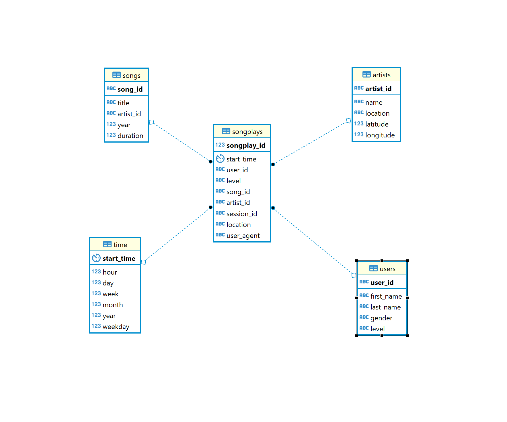
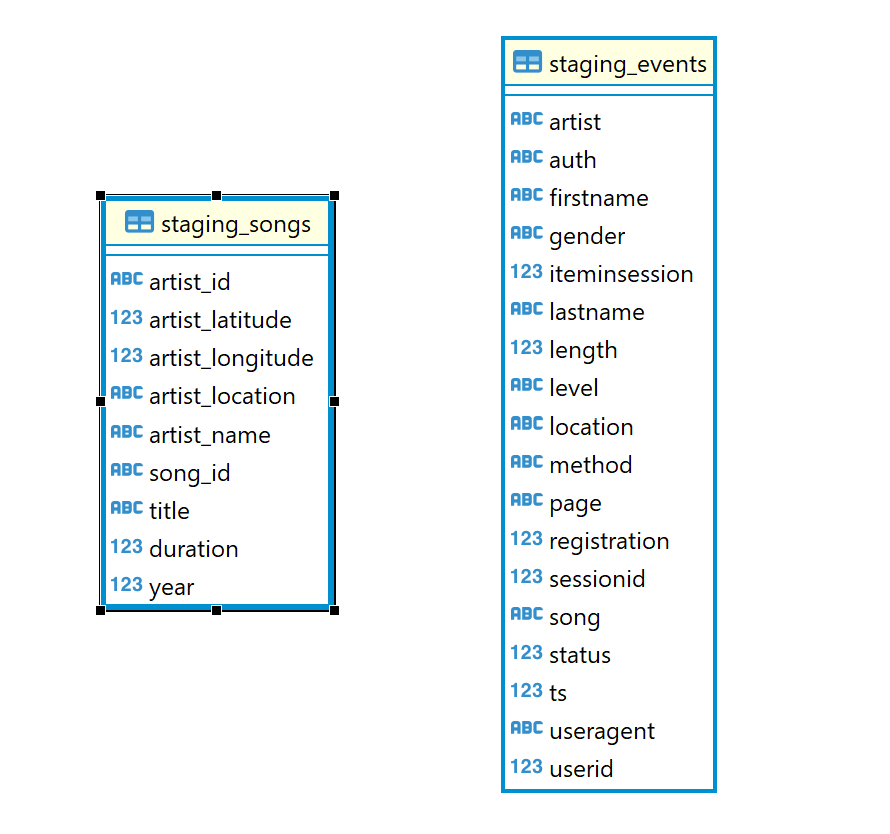

# Udacity Data Engineering Nanodegree - Project 3: Sparkfy Data Warehouse

## Description

The goal of this project is to create a data warehouse infrastructure to Sparkify, a music streaming app. The company has first shared their song database and usage log as json files, stored in AWS S3 buckets, that are going to be cleaned and organized in a relational database optimized for Sparkfy analysts to use it. 

### Prerequisites

* Python3
* _AWS Python SDK (boto3)

# Usage

This data warehoue (DW) project is implemented using the following services in AWS:
* IAM - users and roles (with access to S3)
* Redshift - to be used as our staging area and for our final tables as well

The file `Udacity_Project3_IaC.ipynb` implements the necessary coding for the necessary enviroment in AWS to run this project.
One thing to notice is that you will need an AWS access key and AWS secret for this key, if you're not sure how to setup this programatic access, please refer to AWS documentation.

In the `dwh.cfg` complete the values for the access key and secret to your aws account (remember to never share this information in Github or any other public online page).

After setting up the configuration file, open the notebook mentioned above and create your roles and redshift cluster, get this information and write it in the `dwh.cfg`.

After creating the roles and cluster you can run the project from the console or command line. The files should be executed in the following order:

* `create_tables.py` - Here you setup all the tables in your Redshift cluster
* `etl.py` - To perform the data ingestion in the staging area and the etl to the final tables
---

## Database design

The database designed implements a star schema, with 1 fact table and 4 dimensions. Our fact table `songplays` is the event of playing a song by any user, meanwhile the dimensions are:
* `users` - Contains user information such as name, gender, and subscription type (paid or free)
* `artists` - Contains artists information such as name, location
* `songs` - Contains songs information such as title, artist id, duration, year
* `time` - Contains timestamp information and its associated data, such as month, week, day, weekday, year, and hour
 

_*Datbase schema close up to final tables.*_

In the same database, we implemented the staging tables, to be used during the ingestion process of json data from S3 buckets. The tables design is available in the image below:


_*Datbase schema close up to staging tables.*_

## Data Warehouse design

Regarding the data warehouse architecture used, the fact table `songplays` will be distributed across the nodes using the `song_id` column as distribution key, the same key will be used in the `songs` table as distribution key. The dimension table `songs` is distributed across the nodes due to its size.
The dimension tables `artists`, `time`, and `users` are using the distribution style `ALL`, as they contain less records than the fact table and songs table, and they're used in every join with the fact table, this strategy can improve query speed considerably.

## Sample queries
* Explore the number of records in the events staging table:

```
SELECT COUNT(*)
FROM staging_events;
```
* Explore the number of records in the songs staging table:

```
SELECT COUNT(*)
FROM staging_songs;
```
* Get the top 100 songs listed in a given year and month:

```
SELECT  songs.title,
        artists.name,
        COUNT(songplays.songplay_id) as Playtime,
        "time".year,
        "time".month
FROM songplays JOIN songs ON (songplays.song_id = songs.song_id) JOIN artists ON (songplays.artist_id = artists.artist_id)
JOIN "time" ON (songplays.start_time = "time".start_time)
WHERE "time".year = 2018 /* Put here the desired year*/ AND "time".month = 11 /* Put here the desired month       */
GROUP BY songs.title, artists.name,"time".year,"time".month
ORDER BY (Playtime) DESC
LIMIT 100;
```

## Note
As this project contains a subset of the `A million songs dataset`, the staging events data contains song titles that are not available in the songs jsons made available, for this reason not all data could be matched for exploratory analysis.

